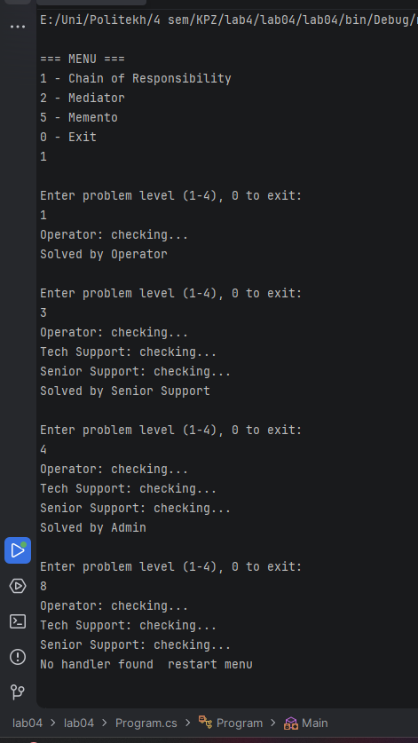
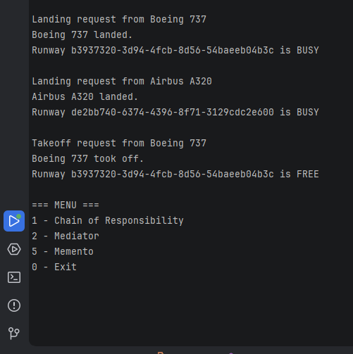
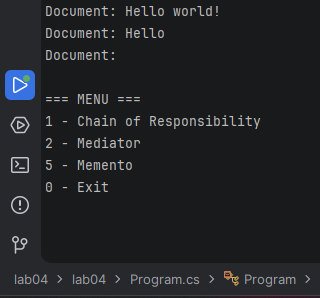

#  Design Patterns Lab Work (C#)

##  Tasks
- Task 1 — Chain of Responsibility
- Task 2 — Mediator
- Task 5 — Memento

---

##  Run project

Start `Program.cs` and choose:

1 - Chain of Responsibility  
2 - Mediator  
5 - Memento  
0 - Exit

---

##  Task 1 — Chain of Responsibility

Support system with 4 levels:
- Operator
- Technical Support
- Senior Support
- Admin

Request goes through chain until handled.

  

---

##  Task 2 — Mediator

Airport system:
- Aircraft
- Runways
- CommandCentre (Mediator)

Aircraft and Runway do NOT communicate directly.

 

---

##  Task 5 — Memento

Text editor with undo functionality.

Each change is saved as a state snapshot.

 

---

##  Conclusion

Patterns used:
- Chain of Responsibility
- Mediator
- Memento